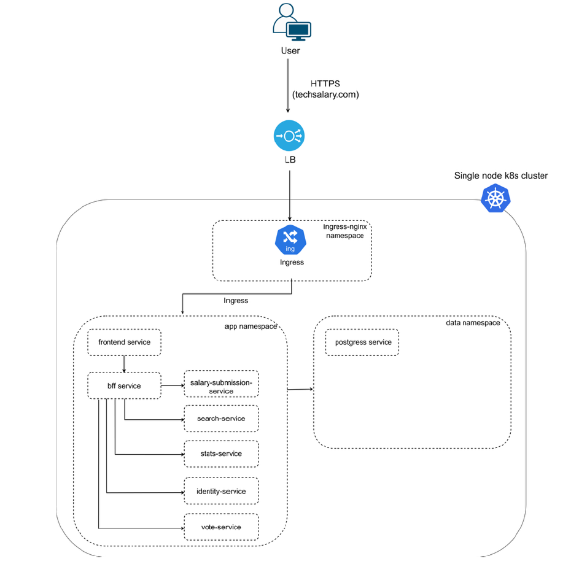

# Tech Salary Transparency Microservice Application - Business Requirements Document (BRD)

This BRD outlines the requirements to create, build, and deploy a microservice application for tech salary transparency in Sri Lanka. First,
refer to the following microservice architecture.

This system is a community-driven technology salary transparency website similar to TechPays.com in Europe and
<https://techsalary.tldr.lk/> in Sri Lanka. Users can anonymously submit salary information, search salaries by country,
company, role, and experience level, and vote on whether submitted salaries are trustworthy. User login is required
only for community actions such as upvoting/downvoting and reporting entries. To protect privacy, user identities
(emails, passwords, account details) are stored separately from salary submissions, and salary records are kept
anonymous and are not directly linked to user emails.

The platform is implemented using a microservices architecture, where each major function—salary submission, identity
management, voting, search, and statistics—is handled by an independent service. All services are containerized using
Docker and deployed within a single-node Kubernetes cluster, which provides consistent deployment, isolation between
services, and easier management.

External traffic is routed through a load balancer and Kubernetes Ingress, which directs requests to the correct services
inside the cluster. Application microservices run in the app namespace, while PostgreSQL runs in the data namespace to
isolate persistent storage from application workloads.

## Explanation of each service in the architecture

- Frontend service: The frontend service provides the user interface of the website. It displays salary search pages,
submission forms, statistics pages, and login screens (only for voting people need to log in). All API requests from
the browser are sent to the BFF service rather than directly to backend microservices.
- BFF service (Backend-for-Frontend): The BFF service acts as the single entry point for the frontend. It handles
request routing, authentication checks, caching, and communication with internal microservices. This keeps the
frontend simple and prevents direct exposure of internal services.
- Salary-submission service: It validates the data, applies anonymization rules, and stores the raw submission in the
database. No personal identity information such as email is stored here and users do not need to login to submit
salary.
- Identity service: The identity service manages user accounts, login, and authentication tokens. User emails and
passwords are stored separately from salary data to protect privacy. Other services only receive a user ID, never
personal details.
- Vote service: The vote service allows logged-in community members to upvote or downvote salary submissions.
When a submission reaches a predefined voting threshold, it is marked as approved.
- Search service: The search service provides a filtered salary lookup based on country, company, role, level, and
other attributes.
- Stats service: The stats service calculates and returns aggregated salary insights, such as averages, medians, and
percentiles for specific locations or roles.
- PostgreSQL service (data namespace): Single database instance, logically separated using schemas: 1)identity
schema for user accounts, 2) salary schema for submissions and approved records, 3) community schema for
votes/reports, 4)Uses persistent storage so data survives restarts.
Implement the complete system described above and deploy it to a single-node Kubernetes cluster on Azure. Your
submission must include working containers, Kubernetes manifests, PostgreSQL schema setup, and proof of the full
workflow (submission → voting → approval → search → stats). Provide screenshots and/or terminal outputs that
demonstrate each step.

## MVP 1.0 Features & Report Review Criteria

1. The report must clearly describe the goal of the system and the required workflow. The report must explain that salary submission is anonymous (no login), login is required only for community actions (upvote/downvote/report), and privacy is protected by separating identity data from salary submission data. The explanation must match the required workflow submission → voting → approval → search → stats.
2. Correctly implement the services described in the architecture with clear responsibilities and correct interactions. The frontend must provide the UI and call only the BFF. The BFF must act as the single entry point and enforce authentication for voting-related actions. The salary-submission service must validate input, store submissions as PENDING, and store the anonymize flag. The identity service must implement signup/login and token generation. The vote service must record votes and apply an approval threshold to mark submissions as APPROVED.
3. Demonstrate correct cloud-native deployment on a single-node Kubernetes cluster. Each service must be containerized using Docker and deployed as a separate Kubernetes Deployment with a corresponding ClusterIP Service. The solution must correctly use namespaces: all microservices must run in the app namespace, while PostgreSQL runs in the data namespace. External traffic must be routed through a load balancer and Kubernetes Ingress, and the ingress rules must correctly forward requests to the intended entry point (frontend/BFF). Configuration must be externalized using ConfigMaps and Secrets, services should remain stateless, and basic readiness/liveness behaviour should be shown (for example using probes or restart evidence).
4. Set up a single PostgreSQL instance with correct logical separation using schemas. The identity schema must contain user and authentication tables. The salary schema must include raw submissions (PENDING), approved submissions (APPROVED), and any required aggregate tables. The community schema must include votes (and reports if implemented). Students must also demonstrate that persistent storage is enabled (PVC), and that identity information such as email is not stored in salary submission tables.
5. Implement privacy and security requirements correctly. Passwords must be stored securely (hashed, not plain text), authentication must be enforced for
voting/reporting endpoints, and internal services must not be directly exposed publicly (only accessible through ingress/BFF). The anonymize toggle must be implemented so that public records hide or generalize identifying information when enabled. The design must ensure salary records are not directly linked to user emails.
6. Provide screenshots and/or terminal outputs proving the system works end-to-end. Evidence must show a salary submission being stored as PENDING, a user successfully signing up/logging in and receiving a token/session, a vote being recorded, the submission becoming APPROVED once the threshold is reached, the approved salary appearing in search results, and the stats output updating based on approved salaries.
7. Maintain complete and reproducible Kubernetes manifests including namespaces, deployments, services, ingress, and persistent volume resources for PostgreSQL. The repository must be well structured and include a README with exact commands to build container images, apply manifests, initialize the database schema, and test the workflow. Configuration and secrets must not be hardcoded in source code.

## Technical Stack

- Frontend: React.js
- BFF: Java Spring Boot
- Identity Service: Java Spring Boot
- Salary Submission Service: Java Spring Boot
- Search Service: Java Spring Boot
- Stats Service: Java Spring Boot
- Vote Service: Java Spring Boot
- Database: PostgreSQL (Supabase)

## Implementation Details

1. Frontend: The React frontend will provide pages for salary submission, search, statistics, and login. It will call the BFF for all API interactions.
2. BFF: The BFF will handle routing, authentication checks, and communication with internal services. It will validate tokens for voting/reporting actions and forward requests to the appropriate microservices.
3. Salary Submission Service: This service will validate incoming salary data, apply anonymization rules based on the anonymize flag, and store submissions in the database with a PENDING status. It will not store any user identity information.
4. Identity Service: This service will manage user accounts, handle signup/login, and generate authentication tokens. User emails and passwords will be stored securely in the identity schema of the database, separate from salary data. Use username, email, and password for user accounts, and ensure passwords are hashed before storage. The service will provide endpoints for user registration and login, returning JWT tokens for authenticated sessions.
5. Vote Service: This service will allow logged-in users to upvote or downvote salary submissions. It will record votes in the community schema and apply an approval threshold to mark submissions as APPROVED when they receive enough positive votes.
6. Search Service: This service will provide filtered search capabilities for approved salary records based on various attributes such as country, company, role, and experience level.
7. Stats Service: This service will calculate and return aggregated salary insights, such as averages, medians, and percentiles for specific locations or roles, based on approved salary records.
8. PostgreSQL: A single PostgreSQL instance will be set up with logical separation using schemas for identity, salary, and community data. Persistent storage will be enabled to ensure data durability across restarts.
9. The backend services are implemented under `backend` directory, and the frontend is implemented under `frontend` directory. Each service will have its own Dockerfile for containerization.
10. Kubernetes manifests will be organized under a `k8s` directory, with subdirectories for each service and shared resources like namespaces and ingress.
11. Incorporate e2e testing to validate the complete workflow from salary submission to approval, search, and stats. This is to be done using Playwright framework, and the tests will be included in the repository with instructions on how to run them. Also include a script to run on the frontend that executes the e2e tests and outputs results in a readable format containing screenshots, video recordings, and logs for comprehensive evidence of the application's functionality and reliability. This will help ensure that all components of the system work together as expected and provide a seamless user experience.
12. The README will include detailed instructions for building Docker images, applying Kubernetes manifests, initializing the database schema, and testing the end-to-end workflow.
13. Ensure that all configuration and secrets are managed securely, avoiding hardcoding sensitive information in the source code.
14. Implement basic health checks and readiness/liveness probes for all services to demonstrate cloud-native best practices.
15. Provide comprehensive documentation within the codebase, including comments and a clear project structure to facilitate understanding and maintenance of the application. This will include explanations of the architecture, service responsibilities, and any important design decisions made during implementation to ensure that future developers can easily navigate and contribute to the project.
16. Each backend service will include logging and error handling to facilitate debugging and monitoring in a production environment. Logs will be structured and include relevant information such as timestamps, service names, and error details to assist in troubleshooting issues effectively.

## Plan: Salary Transparency Platform MVP 1.0

**TL;DR**: Implement the full salary transparency microservice stack across 12 phases in 1-2 days (AI-assisted). Search and Stats services get detailed treatment; Salary and Vote services are lightweight stubs to complete the required workflow. Deployed on any Ubuntu server via k3s with Playwright e2e evidence.

---

### Phase 1: Database Foundation (~1hr)

1. Create `db/init.sql` with 3 schemas:
   - **`identity`** schema: `users` table (id UUID, username, email, password_hash, created_at)
   - **`salary`** schema: `submissions` table (id UUID, job_title, company, country, city, experience_level [JUNIOR/MID/SENIOR/LEAD/PRINCIPAL], years_of_experience, base_salary DECIMAL, currency, employment_type [FULL_TIME/PART_TIME/CONTRACT/FREELANCE], anonymize BOOLEAN, status [PENDING/APPROVED/REJECTED], submitted_at, tech_stack)
   - **`community`** schema: `votes` table (id UUID, submission_id FK, user_id FK, vote_type [UPVOTE/DOWNVOTE], created_at, UNIQUE constraint on submission_id+user_id)
2. Create `db/seed.sql` — 10-15 sample salary entries (mixed statuses) + 2-3 test users for demo
3. Document both Supabase setup and K8s-hosted PostgreSQL

---

### Phase 2: Identity Service (~1.5hr)

1. Fix broken `application.properties` — remove H2 references, add PostgreSQL config via env vars
2. Add `jjwt` dependency to pom.xml
3. Create `User` entity → `identity.users`, `UserRepository`, and DTOs (`SignupRequest`, `LoginRequest`, `AuthResponse`)
4. Create `JwtUtil` — token generation/validation with configurable secret + expiry via env vars
5. Create `AuthService` — signup with BCrypt hashing, login with validation + JWT generation
6. Create `AuthController`:
   - `POST /api/auth/signup` → `{ userId, token }`
   - `POST /api/auth/login` → `{ userId, token, username }`
   - `GET /api/auth/validate` → `{ valid, userId, username }`
7. Enable Spring Boot Actuator health endpoint

- **Port: 8081**

---

### Phase 3: Salary Service — Lightweight Stub (~45min) *parallel with Phase 2*

1. Configure `application.properties` — port 8082, schema=salary, env-based DB config
2. Create `SalarySubmission` entity, repository, and minimal DTOs
3. Create `SalaryController`:
   - `POST /api/salaries` — store new submission as PENDING (no auth required)
   - `GET /api/salaries/{id}` — get single submission
   - `PATCH /api/salaries/{id}/status` — internal endpoint for status updates
4. Anonymization: when `anonymize=true`, hide company name + generalize city in responses

- **Port: 8082**

---

### Phase 4: Vote Service — Lightweight Stub (~45min) *depends on Phase 3*

1. Configure `application.properties` — port 8083, schema=community, `VOTE_THRESHOLD` env var (default: 3)
2. Create `Vote` entity, repository (with count-by-submission query), and DTOs
3. Create `VoteService` — record vote, check threshold, call salary-service PATCH via RestTemplate when threshold met
4. Create `VoteController`:
   - `POST /api/votes` — requires userId from BFF header
   - `GET /api/votes/submission/{submissionId}` — vote counts

- **Port: 8083**

---

### Phase 5: Search Service — Full Implementation (~1.5hr) *parallel with Phase 4*

1. Configure `application.properties` — port 8084, schema=salary (read-only)
2. Create `SalarySubmission` entity (read-only view) and DTOs (`SearchResponse` paginated, `SalarySearchResult`, `FilterOptionsResponse`)
3. Create `SalarySpecification` using JPA Specifications for dynamic filtering: country, company (ILIKE), job_title (ILIKE), experience_level, salary range (min/max), employment_type, tech_stack (ILIKE)
4. Create `SearchService` — enforces `status=APPROVED` filter, handles pagination + sorting, applies anonymization rules
5. Create `SearchController`:
   - `GET /api/search` — full dynamic filter + paginate + sort
   - `GET /api/search/filters` — distinct dropdown values (countries, companies, roles, levels)

- **Port: 8084**

---

### Phase 6: Stats Service — Full Implementation (~1.5hr) *parallel with Phase 4, 5*

1. Configure `application.properties` — port 8085, schema=salary (read-only)
2. Create entity + repository with native SQL queries for aggregations (using PostgreSQL `PERCENTILE_CONT` window functions)
3. Create `StatsService` — compute avg, median, min, max, percentiles (25th/50th/75th/90th), record counts with optional filters
4. Create `StatsController`:
   - `GET /api/stats/summary` — overall stats
   - `GET /api/stats/by-role` — grouped by job title
   - `GET /api/stats/by-company` — grouped by company
   - `GET /api/stats/by-country` — grouped by country
   - `GET /api/stats/by-level` — grouped by experience level
   - `GET /api/stats/compare` — side-by-side comparison

- **Port: 8085**

---

### Phase 7: BFF Service (~1.5hr) *depends on Phases 2-6 (API contracts)*

1. Configure `application.properties` — port 8080, downstream service URLs via env vars
2. Create `RestTemplate` bean config + `ServiceUrlConfig` for centralized URL management
3. Create JWT validation interceptor — validates token on protected routes (`/api/votes`), extracts userId into header
4. Create proxy controllers routing all `/api/**` requests to appropriate downstream services:
   - Auth routes → identity-service (passthrough, no auth)
   - Salary routes → salary-service (no auth for POST)
   - Vote routes → vote-service (**auth required**, inject userId header)
   - Search routes → search-service (no auth)
   - Stats routes → stats-service (no auth)
5. CORS configuration for frontend origin
6. Global exception handler for consistent error responses
7. Aggregated health check endpoint

- **Port: 8080**

---

### Phase 8: Frontend (~2hr) *depends on Phase 7 (API contract)*

1. Install: `react-router-dom`, `axios`, `@mui/material` + `@emotion/react` + `@emotion/styled`
2. Setup routing in `App.js` — `/` (search), `/submit`, `/stats`, `/login`
3. Create shared: `Navbar`, `api.js` (Axios instance → BFF), `AuthContext` (JWT in localStorage)
4. **LoginPage**: Signup/Login toggle form → store JWT on success, redirect
5. **SubmitSalaryPage**: Full salary form (job title, company, country, city, level, years, salary, currency, type, tech stack, anonymize toggle) — no auth required
6. **SearchPage** (home): Filter panel → results table with pagination + sorting + vote buttons (functional if logged in)
7. **StatsPage**: Summary cards + grouped stats tabs (by role/company/country/level) + comparison feature
8. `.env` with `REACT_APP_API_URL`

---

### Phase 9: Dockerization (~1hr) *depends on all code phases*

1. Multi-stage Dockerfile for each backend service: Maven build → JRE-alpine runtime, non-root user
2. Multi-stage Dockerfile for frontend: Node build → nginx-alpine with SPA routing config
3. `docker-compose.yml` at project root for full local development stack (all services + PostgreSQL)
4. `.dockerignore` files

---

### Phase 10: Kubernetes Deployment (~1.5hr) *depends on Phase 9*

1. Namespace manifests: `app` and `data`
2. **`data` namespace**: PostgreSQL Deployment + PVC (5Gi) + ClusterIP Service + ConfigMap (init.sql) + Secret (DB creds)
3. **`app` namespace**: For each service — Deployment (1 replica, resource limits) + ClusterIP Service + ConfigMap + readiness/liveness probes (`/actuator/health`)
4. Frontend Deployment + ClusterIP Service
5. Ingress-nginx: `/` → frontend, `/api/*` → BFF
6. Shared Secret for JWT key + DB password
7. `k8s/deploy.sh` — ordered deployment script (namespaces → secrets → postgres → wait → schema init → backend → frontend → ingress)

---

### Phase 11: Playwright E2E Testing (~1hr) *depends on running system*

1. Create `e2e/` with Playwright setup (`@playwright/test`)
2. Test suites:
   - `salary-submission.spec.ts` — submit salary → verify PENDING
   - `auth.spec.ts` — signup → login → token works
   - `voting.spec.ts` — login → vote → verify approval at threshold
   - `search.spec.ts` — search with filters → verify results
   - `stats.spec.ts` — view stats → verify data
   - `full-workflow.spec.ts` — complete: submit → signup → vote → approve → search → stats
3. Config: screenshots on failure, video always, HTML report
4. `e2e/run-tests.sh` runner script

---

### Phase 12: Documentation & README (~30min)

1. Comprehensive README with: architecture overview, tech stack, prerequisites, local dev setup (Supabase + docker-compose), Ubuntu K8s deployment (k3s install → build images → `k8s/deploy.sh` → verify), running e2e tests, API endpoint reference table, environment variables table, troubleshooting

---

### Relevant Files

| Path | Action |
| --- | --- |
| `db/init.sql`, `db/seed.sql` | Create — schema DDL + sample data |
| identity-service | Implement — entity, repo, service, controller, JWT util |
| salary-service | Implement — lightweight stub (entity, repo, controller) |
| vote-service | Implement — lightweight stub (entity, repo, service, controller) |
| search-service | Implement — full (entity, spec, repo, service, controller) |
| stats-service | Implement — full (entity, repo with native SQL, service, controller) |
| bff-service | Implement — proxy controllers, JWT filter, CORS, config |
| src | Implement — pages, components, services, context |
| `backend/*/Dockerfile`, `frontend/Dockerfile` | Create |
| `docker-compose.yml` | Create |
| `k8s/` directory | Create — namespaces, deployments, services, configmaps, secrets, PVC, ingress, deploy.sh |
| `e2e/` directory | Create — Playwright tests, config, runner script |
| README.md | Rewrite — full documentation |

### Verification

1. Run `docker-compose up` and verify all services start healthy
2. Execute the full workflow manually via curl/Postman: POST salary → POST signup → POST login → POST vote (×3) → GET search → GET stats
3. Run `kubectl get pods -n app` and `kubectl get pods -n data` — all pods Running/Ready
4. Run Playwright e2e suite — all 6 test files pass with screenshots and video evidence
5. Verify PostgreSQL schemas: `\dn` shows identity, salary, community; `SELECT * FROM salary.submissions` shows no email column
6. Verify ingress: external access via domain/IP routes correctly to frontend and `/api/*` to BFF

### Decisions

- **Salary + Vote services**: Minimal stubs — just enough CRUD + threshold logic for the workflow demo
- **Database**: Supabase for local dev, self-hosted PostgreSQL in K8s for deployment — both documented
- **Auth**: Simple JWT with `jjwt` (no Spring Security OAuth2) — lightweight but functional
- **Vote threshold**: Configurable via `VOTE_THRESHOLD` env var, defaults to 3
- **K8s distribution**: k3s recommended for single-node Ubuntu (lightweight, production-ready)
- **UI framework**: Material UI for quick polished MVP look
- **Excluded**: No advanced caching in BFF, no rate limiting, no CI/CD pipeline, no monitoring/logging stack

### Further Considerations

1. **Container registry**: Will you push images to DockerHub, or use a local k3s registry (`localhost:5000`)? **Answer: local registry for simplicity on a single node.**
2. **Domain/TLS**: Do you have a domain pointing to the Ubuntu server, or will you access via IP? This affects Ingress configuration and whether we set up cert-manager for HTTPS. **Answer: Access via IP for simplicity, so no TLS setup required.**
3. **BRD update scope**: Should I also update the BRD with corrections (e.g., fix the "Supabase" mention to reflect the dual-database approach, update the deployment target from Azure to Ubuntu/k3s)? **Answer: Yes, please update the BRD to reflect the actual implementation details and deployment target.**
